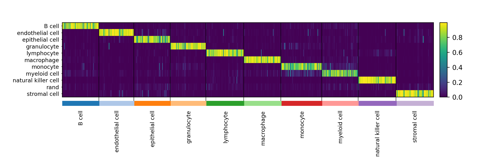
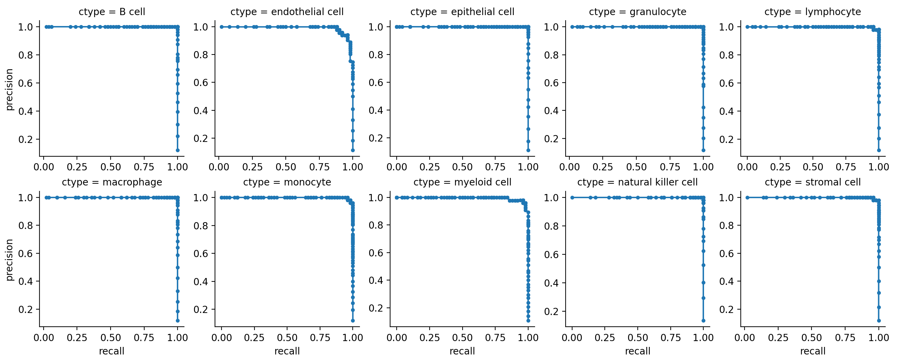
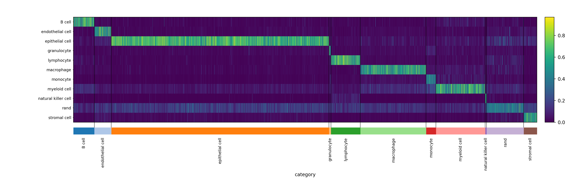
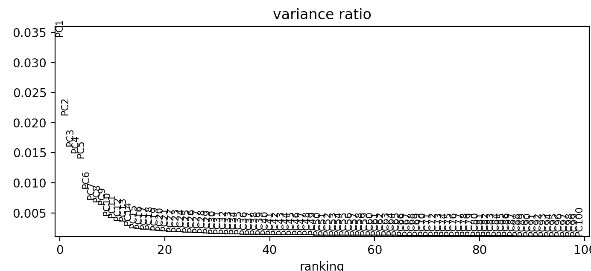
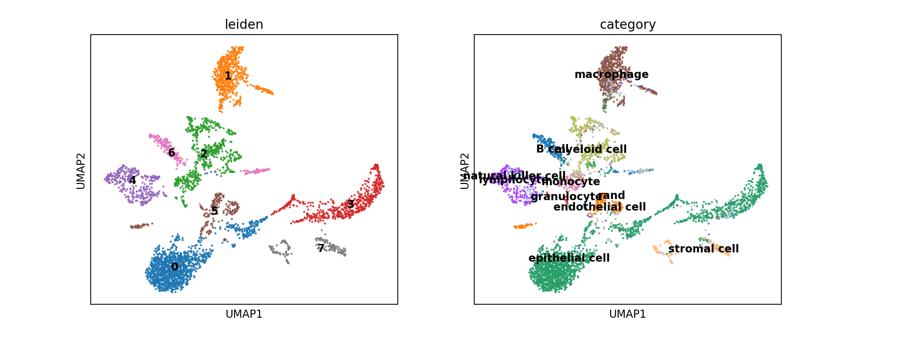
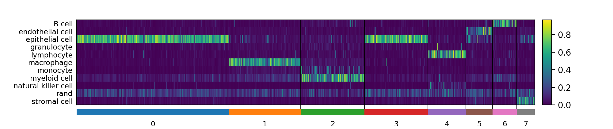
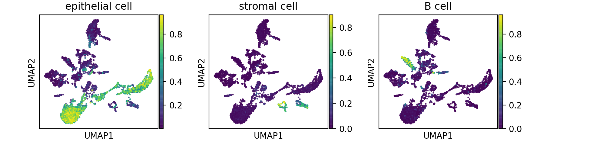

# pySingleCellNet

### Introduction 
SingleCellNet (SCN) is a tool to perform 'cell typing', or classification of single cell RNA-Seq data. Two nice features of SCN are that it works (1) across species and (2) across platforms. See [the original paper](https://doi.org/10.1016/j.cels.2019.06.004) for more details. This repository contains the Python version of SCN. The original code was written in R [original Github Repository](https://github.com/pcahan1/SingleCellNet/). 

### Prerequisites

```python
pip install pandas numpy sklearn scanpy sklearn statsmodels scipy matplotlib seaborn umap-learn
```

### Installation

```python
!pip install git+https://github.com/pcahan1/PySingleCellNet/
```

#### Summary

Below is a brief tutorial that shows you how to use SCN. In this example, we train a classifier based on mouse lung cells, we assess the performance of the classifier on held out data, then we apply the classifier to analyze indepdendent mouse lung data. 

#### Training data
SCN has to be trainined on well-annotated reference data. In this example, we use data geernated as part of the Tabula Muris (Senis) project. Specifically, we use the droplet lung data. We have compiled several other training data sets as listed below. 

[Lung training data](https://s3.amazonaws.com/cnobjects/singleCellNet/pySCN/training/adLung_TabSen_100920.h5ad)

#### Query data
To illustrate how you might use SCN to perform cell tying, we apply it to another dataset from mouse lung:

<cite>Angelidis I, Simon LM, Fernandez IE, Strunz M et al. An atlas of the aging lung mapped by single cell transcriptomics and deep tissue proteomics. Nat Commun 2019 Feb 27;10(1):963. PMID: 30814501</cite>

[Query expression data](https://s3.amazonaws.com/cnobjects/singleCellNet/pySCN/query/GSE124872_raw_counts_single_cell.mtx)

[Query meta-data](https://s3.amazonaws.com/cnobjects/singleCellNet/pySCN/query/GSE124872_Angelidis_2018_metadata.csv)

[Query gene list](https://s3.amazonaws.com/cnobjects/singleCellNet/pySCN/query/genes.csv)

##### Initialize session

```python
import pandas as pd
import matplotlib
import matplotlib.pyplot as plt
import seaborn as sns 
import scanpy as sc
import scipy as sp
import numpy as np
import loompy # only needed if using loom files
import anndata

sc.settings.verbosity = 3 
sc.logging.print_header()

import pySingleCellNet as pySCN
```

##### Load the training data
```python
adTrain = sc.read("adLung_TabSen_100920.h5ad")
adTrain
# AnnData object with n_obs × n_vars = 14813 × 21969 ...

```

##### Load the query data
```python
qDatT = sc.read_mtx("GSE124872_raw_counts_single_cell.mtx")
qDat = qDatT.T

genes = pd.read_csv("genes.csv")
qDat.var_names = genes.x

qMeta = pd.read_csv("GSE124872_Angelidis_2018_metadata.csv")
qMeta.columns.values[0] = "cellid"

qMeta.index = qMeta["cellid"]
qDat.obs = qMeta.copy()
```

##### Find common genes
When you train the classifier, you should ensure that the query data and the reference data are limited to a common set of genes. In this case, we also limit the query data to those cells with at least 500 genes.
```python
genesTrain = adTrain.var_names
genesQuery = qDat.var_names

cgenes = genesTrain.intersection(genesQuery)
len(cgenes)
# 16543

adTrain1 = adTrain[:,cgenes]
adQuery = qDat[:,cgenes].copy()
adQuery = adQuery[adQuery.obs["nGene"]>=500,:].copy()
adQuery
# AnnData object with n_obs × n_vars = 4240 × 16543
```

##### Split the reference data inot training and held out
```python
expTrain, expVal = pySCN.splitCommonAnnData(adTrain1, ncells=200,dLevel="cell_ontology_class")
```

##### Train the classifier. This can take several minutes.
```python
[cgenesA, xpairs, tspRF] = pySCN.scn_train(expTrain, nTopGenes = 100, nRand = 100, nTrees = 1000 ,nTopGenePairs = 100, dLevel = "cell_ontology_class", stratify=True, limitToHVG=True)
```

##### Classify the held-out data and visualize.
``` python
adVal = pySCN.scn_classify(expVal, cgenesA, xpairs, tspRF, nrand = 0)

ax = sc.pl.heatmap(adVal, adVal.var_names.values, groupby='category', cmap='viridis', dendrogram=False, swap_axes=True)
```



##### Determine how well classifier predicts cell type of held out data and plot
```python
assessment =  pySCN.assess_comm(expTrain, adVal, resolution = 0.005, nRand = 0, dLevelSID = "cell", classTrain = "cell_ontology_class", classQuery = "cell_ontology_class")

pySCN.plot_PRs(assessment)
plt.show()
```




##### Classify the independent query data and visualize. The heatmap groups the cells according to the cell type with the maximum SCN classification score. Cells in the 'rand' category have a higher SCN score in the 'random' category than any cell type from the training data.
```python
adQlung = pySCN.scn_classify(adQuery, cgenesA, xpairs, tspRF, nrand = 0)

ax = sc.pl.heatmap(adQlung, adVal.var_names.values, groupby='celltype', cmap='viridis', dendrogram=False, swap_axes=True)
```



##### Visualize but group cells according to the annotation proivded with the associated study.
```python
ax = sc.pl.heatmap(adQlung, adVal.var_names.values, groupby='celltype', cmap='viridis', dendrogram=False, swap_axes=True)
```


##### Add the classification result to the query annData object. We add the SCN scores as well as the softmax classification (i.e. a label corresponding to the cell type with the maximum SCN score -- this goes in adata.obs["category"]). 
```python
pySCN.add_classRes(adQuery, adQlung)
```

##### Typical Scanpy pipeline: 
###### Normalization and PCA
```python
adM1Norm = adQuery.copy()
sc.pp.filter_genes(adM1Norm, min_cells=5)
sc.pp.normalize_per_cell(adM1Norm, counts_per_cell_after=1e4)
sc.pp.log1p(adM1Norm)

sc.pp.highly_variable_genes(adM1Norm, min_mean=0.0125, max_mean=4, min_disp=0.5)

adM1Norm.raw = adM1Norm
sc.pp.scale(adM1Norm, max_value=10)
sc.tl.pca(adM1Norm, n_comps=100)

sc.pl.pca_variance_ratio(adM1Norm, 100)
```




###### KNN, Leiden, UMAP
```python
npcs = 20
sc.pp.neighbors(adM1Norm, n_neighbors=10, n_pcs=npcs)
sc.tl.leiden(adM1Norm,.1)
sc.tl.umap(adM1Norm, .5)
sc.pl.umap(adM1Norm, color=["leiden", "category"], alpha=.9, s=15, legend_loc='on data')
```



##### To to plot a heatmap with the clustering information, you need to add this annotation to the annData object that is returned from scn_classify()
```python
adQlung.obs['leiden'] = adM1Norm.obs['leiden'].copy()
adQlung.uns['leiden_colors'] = adM1Norm.uns['leiden_colors']
ax = sc.pl.heatmap(adQlung, adVal.var_names.values, groupby='leiden', cmap='viridis', dendrogram=False, swap_axes=True)
```



##### You can also overlap SCN score on UMAP embedding.
```python
sc.pl.umap(adM1Norm, color=["epithelial cell", "stromal cell", "B cell"], alpha=.9, s=15, legend_loc='on data', wspace=.3)
```




Table of other training data goes here


