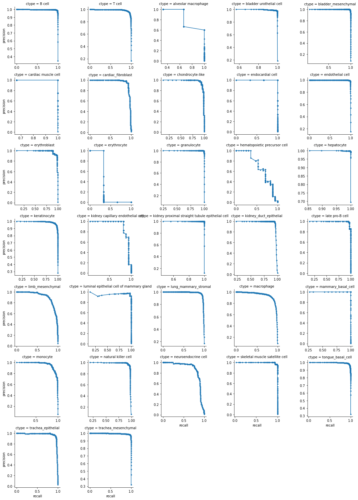
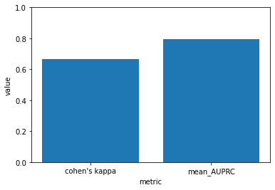
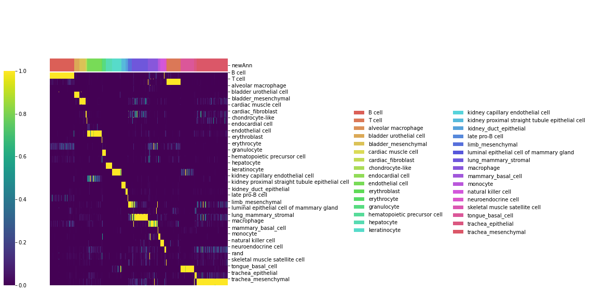
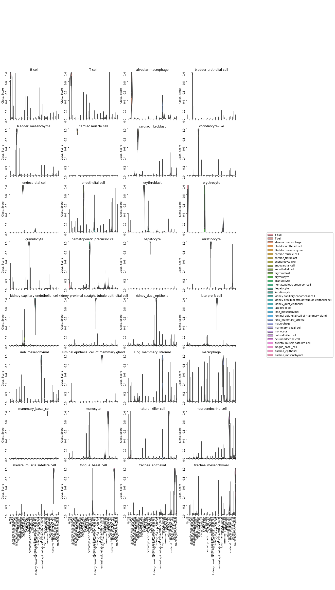
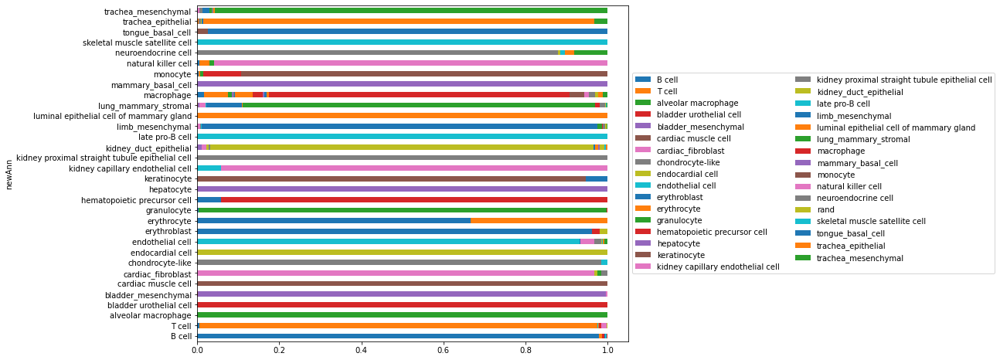
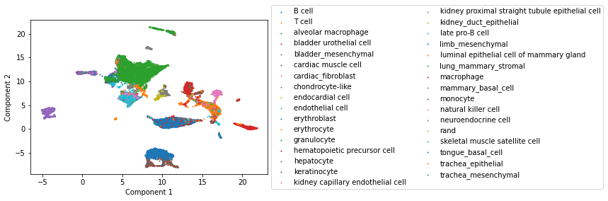

# pySingleCellNet

### Introduction 
SingleCellNet enables the classifcation of single cell RNA-Seq data across species and platforms. See our recent [publication](https://doi.org/10.1016/j.cels.2019.06.004) for more details. This is a python package for singleCellNet that accomplishes the same tasks as the original version written in R. If you prefer to work within R, here is the link to the [original Github Repository](https://github.com/pcahan1/SingleCellNet/).

### Prerequisites

```python
pip install pandas numpy sklearn scanpy sklearn statsmodels scipy matplotlib seaborn umap-learn
```

### Installation

```python
!pip install git+https://github.com/pcahan1/PySingleCellNet/
```

#### Set up

```python
import pySingleCellNet as pySCN
import pandas as pd
import numpy as np
```

#### Load in training data 
A subset of Tabula Muris data is used. 
| DATA TYPE | METADATA | EXPRESSION |
|-------------|----------|------------|
| csv       | [metadata](https://s3.amazonaws.com/cnobjects/singleCellNet/examples/tm10xSubSampTab.csv | [expression data](https://s3.amazonaws.com/cnobjects/singleCellNet/examples/tm10xSubExpDat.csv) |
| rda    | [metadata](https://s3.amazonaws.com/cnobjects/singleCellNet/examples/tm10xSubSampTab.rda) | [expression data](https://s3.amazonaws.com/cnobjects/singleCellNet/examples/tm10xSubExpDat.rda) |

More reference datasets can be found [here](https://github.com/pcahan1/SingleCellNet/)

```python
tmData = pd.read_csv("tm10xSubExpDat.csv", index_col=0)
tmSampTab = pd.read_csv("tm10xSubSampTab.csv", index_col=0)
tmSampTab.newAnn = tmSampTab.newAnn.astype(str)
```

If you are working with an annData object, you can also extract data from AnnData object using makeExpMat and makeSampMat functions
```python
annData = convertRDAtoAdata(expMat_file = "tm10xSubexpDat.rda",sampTab_file = "tm10xSubSampTab.rda", file_path = ".")

tmData = makeExpMat(annData)
tmSampTab = makeSampTab(annData)
tmSampTab.newAnn = tmSampTab.newAnn.astype(str)
```

#### Split data into training and validation

```python
expTrain, expVal = pySCN.splitCommon(expData=tmData, ncells=100,sampTab=tmSampTab, dLevel="newAnn")
stTrain = tmSampTab.loc[expTrain.index,:]
stVal = tmSampTab.loc[expVal.index,:]
```    

#### Train pySCN classifier

```python
[cgenesA, xpairs, tspRF] = pySCN.scn_train(stTrain = stTrain, expTrain = expTrain,
                   nTopGenes = 10, nRand = 70, nTrees = 1000,nTopGenePairs = 25, dLevel = "newAnn", stratify=True)
```

#### Apply to held-out Data

```python
classResVal = pySCN.scn_predict(cgenesA, xpairs, tspRF, expVal, nrand = 0)
```

#### Assess pySCN classifier

```python
tm_heldoutassessment = pySCN.assess_comm(classResVal, stTrain, stVal, resolution = 0.005, nRand = 0, dLevelSID = "cell", classTrain = "newAnn", classQuery = "newAnn")
```

```python
pySCN.plot_PRs(tm_heldoutassessment)
```



```python
pySCN.plot_metrics(tm_heldoutassessment)
```



#### Plot the classification clustermap, violin plot and attribution plot 

```python
pySCN.sc_hmClass(classResVal.loc[stVal.index,:], stVal["newAnn"],cRow=False,cCol=False)
```



```python
pySCN.sc_violinClass(stVal, classResVal, threshold=0.5, dLevel="newAnn", ncol=4 )
```


```python
pySCN.plot_attr(classResVal, stVal, "newAnn")
```



#### Assign classification

```python
#Assign classification from pySCN, add it to sample table and plot UMAP of validation data colored by classifcation category 

stVal = pySCN.get_cate(classResVal, stVal, cThresh = 0)
pySCN.plot_umap(expVal, stVal, dLevel="category")
```




